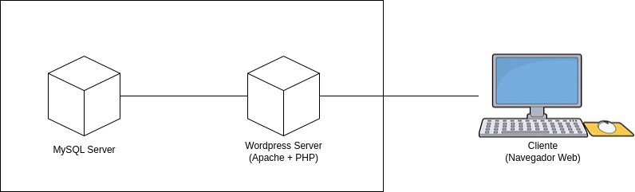

# Criando Arquivos Docker Compose

Neste STEP você aprenderá a criar arquivos Docker Compose. Para isso, utilizaremos a imagem do Wordpress como exemplo.

## STEP 4.1 - Entendendo o problema

Primeiro, iremos entender o problema que o Docker Compose resolve. Imaginamos que tivéssemos uma aplicação Wordpress que depende de um banco de dados MySQL. Para que pudéssemos subir esses containers seria necessário subir manualmente o MySQL e o Wordpress.



Para subirmos o MySQL, teríamos que utilizar o seguinte comando:

```
docker run --detach --name db --env "MYSQL_DATABASE=exampledb" --env "MYSQL_USER=exampleuser" --env "MYSQL_PASSWORD=examplepass" --env "MYSQL_RANDOM_ROOT_PASSWORD='1'" --volume "db:/var/lib/mysql" mysql:8.0
```

E para subirmos o Wordpress, teríamos que utilizar o seguinte comando:

```
docker run --detach --name wordpress --env "WORDPRESS_DB_HOST=db" --env "WORDPRESS_DB_USER=exampleuser" --env "WORDPRESS_DB_PASSWORD=examplepass" --env "WORDPRESS_DB_NAME=exampledb" --volume "wordpress:/var/www/html" --publish "8080:80" wordpress:6.7.2-php8.1-apache
```

E para aplicações que demandassem outros containers, haveriam mais comandos para serem executados. Dessa forma, a dificuldade para subir aplicações com múltiplos container seria gigantesca.

Alguém poderia sugerir a criação de scripts shell para automatizar o deploy desses containers. O problema dessa solução é que ela seria difícil de manter, uma vez que cada programador tem a sua forma de escrever scripts, resultando na dificuldade da compreensão e da manutenibilidade.

A solução para esse problema é a criação de arquivos declarativos no formato Docker Compose.

## STEP 4.2 - Criando arquivo Docker Compose

### STEP 4.2.1 - Criando novo arquivo

Em um editor de texto, crie um novo arquivo com o seguinte nome: ```docker-compose.yml```.

### STEP 4.2.2 - Adicionando serviços

Adicione a chave raíz ```services``` no arquivo:

```
services:
```

Em seguida, adicione os serviços a serem criados:

```
services:
  wordpress:
  db:
```

### STEP 4.2.3 - Adicionando imagens

Para cada serviço, adicione as imagens Docker a serem utilizadas. No nosso exemplo serão utilizadas as seguintes imagens: ```wordpress:6.7.2-php8.1-apache``` e ```mysql:8.0```. 

O arquivo ```docker-compose.yml``` ficará da seguinte forma:

```
services:
  wordpress:
    image: wordpress:6.7.2-php8.1-apache
  db:
    image: mysql:8.0
```

### STEP 4.2.3 - Adicionando variáveis de ambiente

Para cada serviço, adicione as variáveis de ambiente a serem utilizadas.

O arquivo ```docker-compose.yml``` ficará da seguinte forma:

```
services:
  wordpress:
    image: wordpress:6.7.2-php8.1-apache
    environment:
      WORDPRESS_DB_HOST: db
      WORDPRESS_DB_USER: exampleuser
      WORDPRESS_DB_PASSWORD: examplepass
      WORDPRESS_DB_NAME: exampledb
  db:
    image: mysql:8.0
    environment:
      MYSQL_DATABASE: exampledb
      MYSQL_USER: exampleuser
      MYSQL_PASSWORD: examplepass
      MYSQL_RANDOM_ROOT_PASSWORD: '1'
```

### STEP 4.2.3 - Adicionando volumes

Para cada serviço, adicione os volumes a serem utilizados.

O arquivo ```docker-compose.yml``` ficará da seguinte forma:

```
services:
  wordpress:
    image: wordpress:6.7.2-php8.1-apache
    environment:
      WORDPRESS_DB_HOST: db
      WORDPRESS_DB_USER: exampleuser
      WORDPRESS_DB_PASSWORD: examplepass
      WORDPRESS_DB_NAME: exampledb
    volumes:
      - wordpress:/var/www/html
  db:
    image: mysql:8.0
    environment:
      MYSQL_DATABASE: exampledb
      MYSQL_USER: exampleuser
      MYSQL_PASSWORD: examplepass
      MYSQL_RANDOM_ROOT_PASSWORD: '1'
    volumes:
      - db:/var/lib/mysql
```

### STEP 4.2.3 - Criando os volumes

Para cada volume adicionado aos serviços, defina eles na chave raiz ```volumes```.

O arquivo ```docker-compose.yml``` ficará da seguinte forma:

```
services:
  wordpress:
    image: wordpress:6.7.2-php8.1-apache
    environment:
      WORDPRESS_DB_HOST: db
      WORDPRESS_DB_USER: exampleuser
      WORDPRESS_DB_PASSWORD: examplepass
      WORDPRESS_DB_NAME: exampledb
    volumes:
      - wordpress:/var/www/html
  db:
    image: mysql:8.0
    environment:
      MYSQL_DATABASE: exampledb
      MYSQL_USER: exampleuser
      MYSQL_PASSWORD: examplepass
      MYSQL_RANDOM_ROOT_PASSWORD: '1'
    volumes:
      - db:/var/lib/mysql
      
volumes:
  wordpress:
  db:
```

### STEP 4.2.4 - Exportando as portas

Para os containers aos quais terão portas de rede acessadas, exporte essas portas.

O arquivo ```docker-compose.yml``` ficará da seguinte forma:

```
services:
  wordpress:
    image: wordpress:6.7.2-php8.1-apache
    ports:
      - "8080:80"
    environment:
      WORDPRESS_DB_HOST: db
      WORDPRESS_DB_USER: exampleuser
      WORDPRESS_DB_PASSWORD: examplepass
      WORDPRESS_DB_NAME: exampledb
    volumes:
      - wordpress:/var/www/html
  db:
    image: mysql:8.0
    environment:
      MYSQL_DATABASE: exampledb
      MYSQL_USER: exampleuser
      MYSQL_PASSWORD: examplepass
      MYSQL_RANDOM_ROOT_PASSWORD: '1'
    volumes:
      - db:/var/lib/mysql
      
volumes:
  wordpress:
  db:
```

### STEP 4.2.5 - Defina a política de reinicialização

Para cada serviço, defina a política de reinicialização.

Os valores disponíveis são: ```always```, ```no```, ```on-failure``` e ```unless-stopped```. Neste exemplo será utilizado a política ```always```. 

O arquivo ```docker-compose.yml``` ficará da seguinte forma:

```
services:
  wordpress:
    image: wordpress:6.7.2-php8.1-apache
    restart: always
    ports:
      - "8080:80"
    environment:
      WORDPRESS_DB_HOST: db
      WORDPRESS_DB_USER: exampleuser
      WORDPRESS_DB_PASSWORD: examplepass
      WORDPRESS_DB_NAME: exampledb
    volumes:
      - wordpress:/var/www/html
  db:
    image: mysql:8.0
    restart: always
    environment:
      MYSQL_DATABASE: exampledb
      MYSQL_USER: exampleuser
      MYSQL_PASSWORD: examplepass
      MYSQL_RANDOM_ROOT_PASSWORD: '1'
    volumes:
      - db:/var/lib/mysql
      
volumes:
  wordpress:
  db:
```

### STEP 4.2.6 - Subindo os containers

Com o arquivo Docker Compose pronto, iremos subir os containers. Para isso, na pasta do arquivo, abra um terminal (ou Prompt de Comando), e digite o seguinte comando:

```
docker compose up --detach
```

Será mostrada uma saída parecida com esta:

```
[+] Running 35/35
 ✔ wordpress Pulled                                                       52.4s 
 ✔ db Pulled                                                              75.1s 
[+] Running 4/4
 ✔ Volume "criando-arquivos-docker-compose_db"            Created          0.0s 
 ✔ Volume "criando-arquivos-docker-compose_wordpress"     Created          0.0s 
 ✔ Container criando-arquivos-docker-compose-wordpress-1  Started          0.3s 
 ✔ Container criando-arquivos-docker-compose-db-1         Started          0.2s 
```

### STEP 4.2.7 - Listando os containers

Com os containers em execução, iremos listar todos os containers. Para isso, em um terminal (ou Prompt de Comando), digite o seguinte comando:

```
docker ps
```

Será mostrada uma saída parecida com esta:

```
CONTAINER ID   IMAGE                           COMMAND                  CREATED              STATUS              PORTS                                     NAMES
a357968736ed   wordpress:6.7.2-php8.1-apache   "docker-entrypoint.s…"   About a minute ago   Up About a minute   0.0.0.0:8080->80/tcp, [::]:8080->80/tcp   criando-arquivos-docker-compose-wordpress-1
01cfe00dcbc4   mysql:8.0                       "docker-entrypoint.s…"   About a minute ago   Up About a minute   3306/tcp, 33060/tcp                       criando-arquivos-docker-compose-db-1
```

### STEP 4.2.8 - Testando o funcionamento do Wordpress

Nesta etapa, testaremos o funcionamento do Wordpress. Para isso, em um navegador web (na mesma máquina), acesse: http://127.0.0.2:8080

Caso o Wordpress esteja funcionando corretamente, será exibido o símbolo do Wordpress com o menu de seleção de idioma.

### STEP 4.2.9 - Parando os containers

Nesta etapa, iremos para os containers. Para isso, na pasta do arquivo, abra um terminal (ou Prompt de Comando), e digite o seguinte comando:

```
docker compose down
```