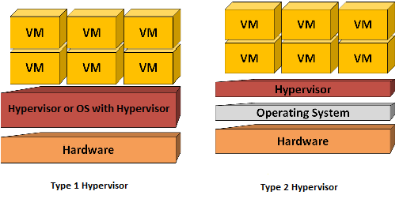

# Introdução ao Docker

Neste STEP você entenderá quais são os problemas que o Docker resolve, e como ele é diferente de uma máquina virtual tradicional. Se tratando de um STEP introdutório, não haverá nenhuma atividade a ser realizada.

## STEP 0.1 - Entendendo o problema

No desenvolvimento de aplicações é comum enfrentarmos o desafio de que a aplicação rode em diferentes ambientes. Dessa forma, uma aplicação pode funcionar perfeitamente em um determinado ambiente, e em outro apresentar erros de execução. Isso acontece devido às diferenças entre os ambientes, como versões de bibliotecas, configurações do sistema, dependências instaladas, sistema operacional utilizado, dentre outros fatores. Esse cenário pode ser resumido na seguinte frase:

> "Na minha máquina funciona!"
 
Outra dificuldade encontrada é a dificuldade de manter e configurar ambientes para diferentes serviços, como banco de dados, servidores web, aplicações backend. Isso torna-se ainda mais complicado quando existe a necessidade de escalar as aplicações ou gerenciar múltiplas versões e dependências.

## STEP 0.2 - Máquinas Virtuais

Antes do Docker ser criado, a solução utilizada era o uso de máquinas virtuais. Dessa forma, cada aplicação era isolada em uma máquina virtual, de modo que todas as dependências e bibliotecas dessa máquina fossem instaladas e todas as configurações definidas, garantindo a correta execução da aplicação.

O funcionamento de máquinas virtuais depende de um Hypervisor, que é um software que permite a criação e execução de máquinas virtuais, que possibilita que a máquina hospedeira (_host_) rode várias máquinas convidadas (_guest_) em um mesmo hardware. Existem dois tipos de Hypervisors: Bare Metal e Hosted, a diferença entre eles é que o Bare Metal é instalado diretamente sobre a máquina hospedeira, enquanto o Hosted é instalado sobre um sistema operacional hospedeiro (Windows, Linux ou Mac).

 "<a rel="noopener noreferrer" href="https://www.flickr.com/photos/130854786@N05/16272423579">Type_1_and_2_hypervisor</a>" by <a rel="noopener noreferrer" href="https://www.flickr.com/photos/130854786@N05">daneschupbach</a> is licensed under <a rel="noopener noreferrer" href="https://creativecommons.org/licenses/by-sa/2.0/?ref=openverse">CC BY-SA 2.0 </a>.

A título de curiosidade, existem diferentes softwares que permitem rodar máquinas virtuais no seu computador: [Oracle VM VirtualBox](https://www.virtualbox.org/), [VMware Workstation](https://blogs.vmware.com/workstation/2024/05/vmware-workstation-pro-now-available-free-for-personal-use.html), [QEMU](https://www.qemu.org/). A criação, utilização e gerenciamento de máquinas virtuais está fora do escopo deste laboratório.

O principal problema das máquinas virtuais é que elas consomem muitos recursos, são lentas para inicializar e difíceis de serem gerenciadas em larga escala.

## STEP 0.3 - Docker

O Docker surgiu como uma alternativa muito mais leve, muito mais eficiente e portátil em relação às máquinas virtuais. Ao invés de virtualizar o sistema operacional inteiro, o Docker utiliza o conceito de **containers**, que compartilham o mesmo Kernel do sistema operacional, mas que funcionam de forma isolada uns dos outros.

Dessa forma, através do Docker é possível containerizarmos uma aplicação com todas as suas dependências necessárias para rodar, permitindo que ela seja executada em qualquer lugar, seja no computador do desenvolvedor, no servidor de testes, no servidor de produção ou mesmo na nuvem.