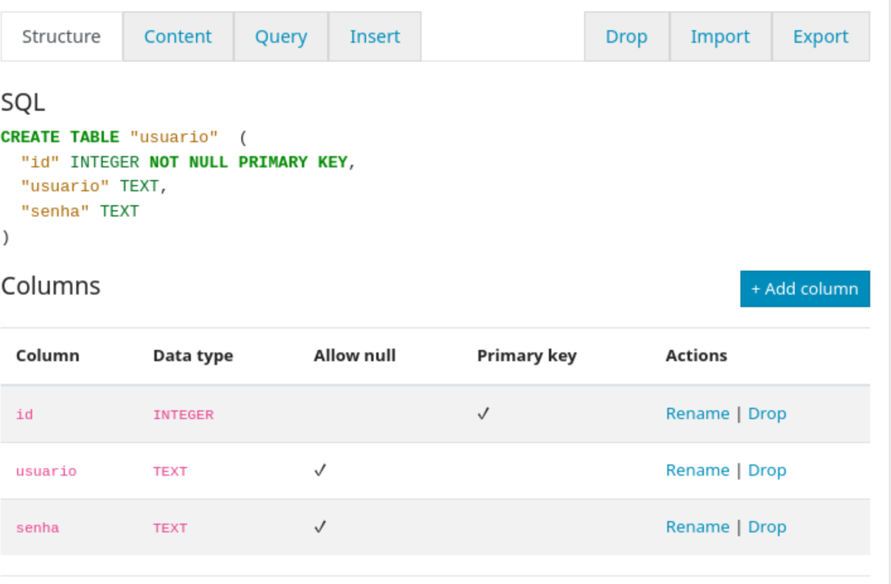

# Montando Volumes

Neste STEP você aprenderá a montar volumes em containers Docker. Para isso, utilizaremos a imagem do banco de dados sqlite-web.

## STEP 2.1 - O que são volumes?

Quando um container Docker é deletado, todas as informações armazenadas dentro dele são perdidas. Para que os dados criados dentro desse container possam continuar existindo mesmo após a sua destruição, é necessário a criação e a montagem de volumes.

## STEP 2.2 - Baixando o sqlite-web

Nesta etapa, iremos baixar o sqlite-web. Para isso, em um terminal (ou Prompt de Comando), digite o seguinte comando:

```
docker pull ghcr.io/coleifer/sqlite-web:latest
```

O ```ghcr.io``` é o registro de containers do GitHub.

Caso a imagem não tenha sido baixada, será mostrada uma saída parecida com esta:

```
latest: Pulling from coleifer/sqlite-web
48ecbb6b270e: Pull complete 
692f29ee68fa: Pull complete 
6439819450d1: Pull complete 
3c7be240f7bf: Pull complete 
ca4b349df8ed: Pull complete 
a7adb8af9dab: Pull complete 
a09b377e5b4d: Pull complete 
Digest: sha256:31e338c418777ade2afaaa1634e7fb96cf4ff310a1f77ee6fc9c59f22642dfaa
Status: Downloaded newer image for ghcr.io/coleifer/sqlite-web:latest
ghcr.io/coleifer/sqlite-web:latest
```

## STEP 2.3 - Testando o sqlite-web (sem persistência)

### STEP 2.3.1 - Criando e executando o sqlite-web (sem persistência)

Nesta próxima etapa, criaremos e executaremos o sqlite-web sem haver nenhuma persistência de dados. Para isso, em um terminal (ou Prompt de Comando), digite o seguinte comando:

```
docker run --name sqliteweb --env SQLITE_DATABASE=db_filename.db --interactive --tty --publish 8080:8080 ghcr.io/coleifer/sqlite-web:latest
```

## STEP 2.3.2 - Modificando o banco de dados

Nesta etapa, iremos modificar o banco de dados. Para isso, em um navegador web (na mesma máquina), acesse: http://127.0.0.1:8080

### STEP 2.3.2.1 - Criando Tabela

No canto superior direito, serão mostradas as opções: ```new_table_name``` com os botões ```create``` e ```query```. Em ```new_table_name``` digite ```usuario```, e clique em ```create```.


### STEP 2.3.2.2 - Criando Colunas

#### STEP 2.3.2.2.1 - Criando Coluna 'usuario'

No menu de navegação, serão mostradas as seguintes opções: ```Structure```, ```Content```, ```Query```, ```Insert```, ```Drop```, ```Import``` e ```Export```. Clique em ```Structure```.

Clique no botão ```Add column```, á direita de ```Columns```.


No campo ```Column name```, digite ```usuario```. E em ```Column type```, selecione ```TEXT```. E clique ```Add column```.

#### STEP 2.3.2.2.2 - Criando Coluna 'senha'

Repita o passo anterior, para a coluna 'senha'.

E no final teremos uma tabela com a seguinte estrutura:
- ```id``` como ```INTEGER``` não nulo.
- ```usuario``` como ```TEXT```.
- ```senha``` como ```TEXT```.



### STEP 2.3.2.3 - Inserindo dados

No menu de navegação, serão mostradas as seguintes opções: ```Structure```, ```Content```, ```Query```, ```Insert```, ```Drop```, ```Import``` e ```Export```. Clique em ```Insert```.

No campo ```username```, digite: ```john.doe```. E no campo ```senha```, digite ```1234```.

Repita esse passo para o usuário ```john.smith``` e a senha ```password```.

E no final teremos uma tabela com a seguinte estrutura:

| id   | username   | password   |
|------|------------|------------|
| 1    | john.doe   | 1234       |
| 2    | john.smith | password   |


## STEP 2.3.3 - Parando e deletando o container

Nesta etapa iremos parar e deletar o container Docker. Para isso, em um terminal (ou Prompt de Comando), digite os seguintes comandos:

```
docker stop sqliteweb
```

```
docker rm sqliteweb
```

## STEP 2.3.4 - Criando e executando novamente o sqlite-web

Nesta próxima etapa, criaremos e executaremos novamente o sqlite-web. Para isso, em um terminal (ou Prompt de Comando), digite o seguinte comando:

```
docker run --name sqliteweb --env SQLITE_DATABASE=db_filename.db --interactive --tty --publish 8080:8080 ghcr.io/coleifer/sqlite-web:latest
```

## STEP 2.3.5 - Acessando o banco de dados

Nesta etapa, iremos acessar novamente o banco de dados. Para isso, em um navegador web (na mesma máquina), acesse: http://127.0.0.1:8080

Note que não exite mais a tabela ```usuario```, ela foi deletada junto com o container sqlite-web.

## STEP 2.3.6 - Parando e apagando o container

Agora, iremos deletar o container. Para isso, em um terminal (ou Prompt de Comando), digite os seguintes comandos:

```
docker stop sqliteweb
```

```
docker rm sqliteweb
```

## STEP 2.4 - Testando o sqlite-web (com persistência)

### STEP 2.4.1 - Criando e executando o sqlite-web (com persistência)

Nesta próxima etapa, criaremos e executaremos o sqlite-web com persistência de dados. Para isso, em um terminal (ou Prompt de Comando), digite o seguinte comando:

```
docker run --name sqliteweb --volume 'sqlitewebdata:/data' --env SQLITE_DATABASE=db_filename.db --interactive --tty --publish 8080:8080 ghcr.io/coleifer/sqlite-web:latest
```

## STEP 2.4.2 - Modificando o banco de dados

Nesta etapa repetiremos o que foi feito no [STEP 2.3.2](#step-232---modificando-o-banco-de-dados).

## STEP 2.4.3 - Parando e deletando o container

Nesta etapa repetiremos o que foi feito no [STEP 2.3.3](#step-233---parando-e-deletando-o-container).

## STEP 2.4.4 - Criando e executando novamente o sqlite-web

Nesta próxima etapa, criaremos e executaremos novamente o sqlite-web. Para isso, em um terminal (ou Prompt de Comando), digite o seguinte comando:

```
docker run --name sqliteweb --volume 'sqlitewebdata:/data' --env SQLITE_DATABASE=db_filename.db --interactive --tty --publish 8080:8080 ghcr.io/coleifer/sqlite-web:latest
```

## STEP 2.4.5 - Acessando o banco de dados

Nesta etapa, iremos acessar novamente o banco de dados. Para isso, em um navegador web (na mesma máquina), acesse: http://127.0.0.1:8080

Note que a tabela ```usuario``` continua existindo.

## STEP 2.4.6 - Parando e apagando o container

Nesta etapa repetiremos o que foi feito no [STEP 2.3.6](#step-236---parando-e-apagando-o-container).

## STEP 2.4.7 - Deletando o volume

Nesta etapa, iremos deletar o volume criado. Para isso, em um terminal (ou Prompt de Comando), digite o seguinte comando:

```
docker volume rm sqlitewebdata 
```

E será mostrada a seguínte saída:
```
sqlitewebdata
```