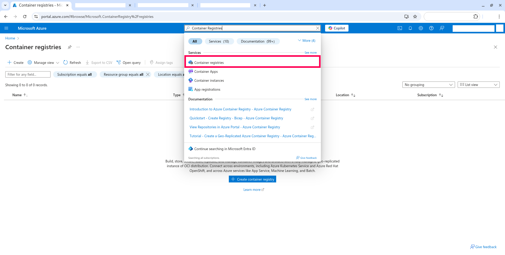
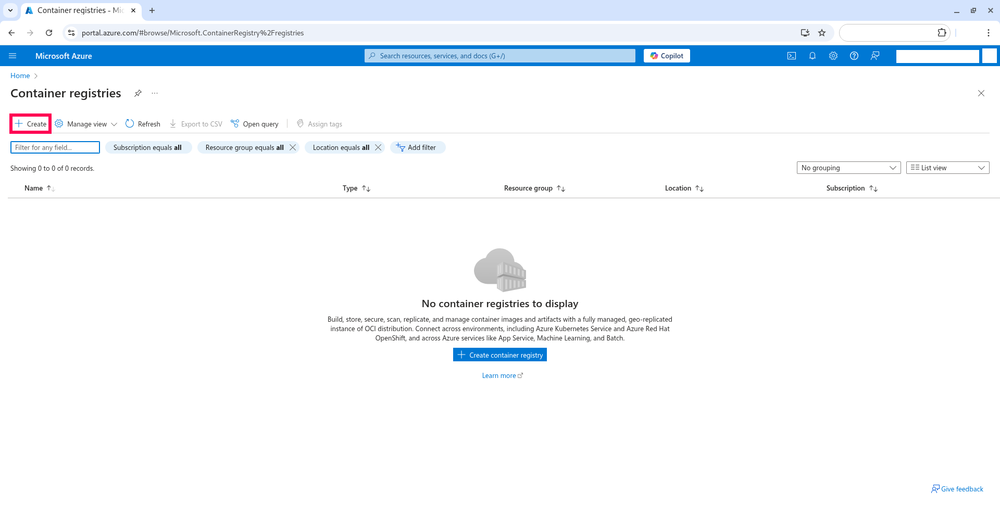
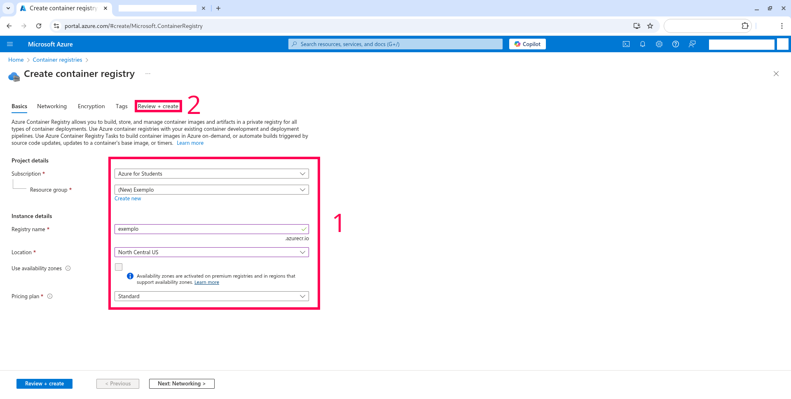
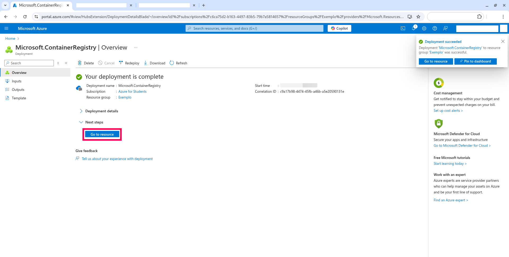
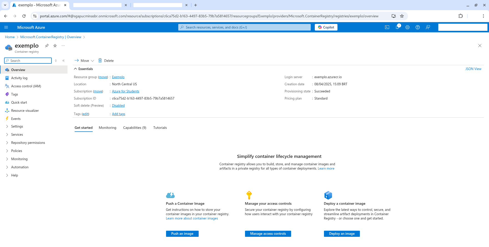
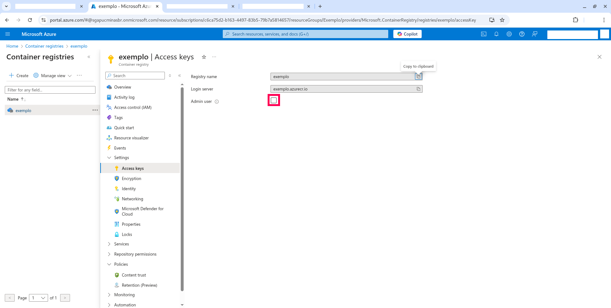
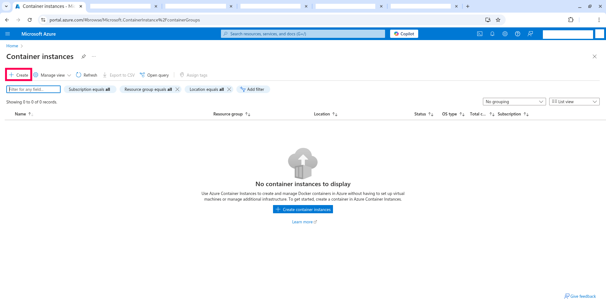
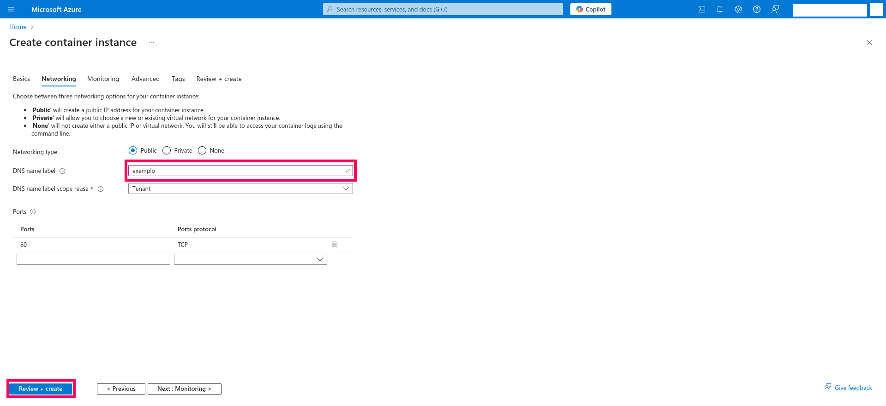
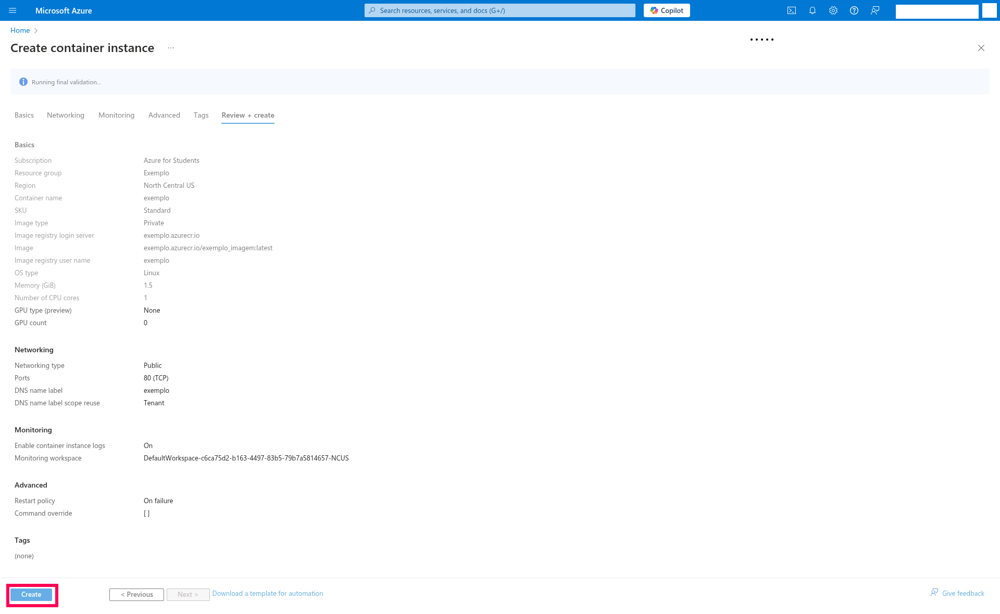

# Subindo uma imagem de container para a nuvem do Microsoft Azure

Neste STEP você subirá a aplicação containerizada para a nuvem do Microsoft Azure.

## STEP 6.1 - Criação de uma conta de estudante no Microsoft Azure

O Instituto de Ciências Exatas e Informática (ICEI) da PUC Minas possuí parceria com a Microsoft, dando um crédito de US$100 para cada aluno anualmente. Para criar sua conta de estudante, basta seguir o [tutorial no site do ICEI](https://icei.pucminas.br/index.php/azurepucminas).

## STEP 6.2 - Instalando o Azure CLI

Instale o Azure CLI em sua máquina. Siga os passos do tutorial oficial da Microsoft: https://learn.microsoft.com/pt-br/cli/azure/install-azure-cli

## STEP 6.3 - Realizando login no Azure CLI

Com o Azure CLI instalado, em um terminal, digite o seguinte comando:

```
az login
```

Uma janela no navegador web padrão se abrirá, e solicitará o seu login e senha do Microsoft Azure. Faça login com o usuário e senha utilizados na criação da conta do Azure.

No terminal, será exibida a seguinte mensagem:

```
A web browser has been opened at https://login.microsoftonline.com/organizations/oauth2/v2.0/authorize. Please continue the login in the web browser. If no web browser is available or if the web browser fails to open, use device code flow with `az login --use-device-code`.

Retrieving tenants and subscriptions for the selection...

[Tenant and subscription selection]

No     Subscription name    Subscription ID                       Tenant
-----  -------------------  ------------------------------------  ---------------
[1] *  Azure for Students   SEU-SUBSCRIPTION-ID                   sga.pucminas.br

The default is marked with an *; the default tenant is 'sga.pucminas.br' and subscription is 'Azure for Students' (SEU-SUBSCRIPTION-ID).

Select a subscription and tenant (Type a number or Enter for no changes):
```

Digite o número (```No```) da inscrição cujo ```Subscription name``` esteja escrito ```Azure for Students``` e pressione ENTER.

## STEP 6.4 - Criando Container Registry no Microsoft Azure

### STEP 6.4.1 - Acessando o Container Registries

No [console do Microsoft Azure](https://portal.azure.com/), na barra de pesquisa, digite ```Container Registries```, e clique na opção 'Container Registries'. 



### STEP 6.4.2 - Criando um novo container Registry

No menu 'Container Registries', clique no botão 'Create'.



Na aba basics, nos campos (em 1, na imagem abaixo), deixe da seguinte forma:

| Opção                  | Valor                |
|------------------------|----------------------|
| Subscription           | 'Azure for Students' |
| Resource group         | '(New) Exemplo'      |
| Registry name          | 'exemplo'            |
| Location               | 'North Central US'   |
| Use availability zones | Desmarcado           |
| Pricing plan           | 'Standard'           |

O 'Registry name' ```exemplo``` deve ser substituído pelo nome do seu container registry, que deve ser único.

Depois, clique na aba 'Review + Create' (em 2, na imagem abaixo).



E depois, clique em no botão 'Create', no canto inferior esquerdo.


Será mostrado o painel de Deployment com a mensagem 'Your deployment is complete'. Clique no botão ```Go to resource```. 



Será exibido o painel do container registry criado.



### STEP 6.4.3 - Adicionando acesso de administrador ao Container Registry

No 'Container Registry' criado, clique em 'Settings' e em 'Access Keys'.

Marque a caixa de seleção ```Admin user```.



### STEP 6.4.5 - Faça login no Azure Container Registry

Para realizarmos login no Azure Container Registry, em um terminal (ou Prompt de Comando), digite o seguinte comando:

```
az acr login --name exemplo
```

O 'Registry name' ```exemplo``` deve ser substituído pelo nome do seu container registry, que deve ser único.

### STEP 6.4.6 - Crie uma tag para a imagem

Para que o Docker possa vincular a imagem criada ao container, é necessário a criação de uma tag. Para isso, em um terminal (ou Prompt de Comando), digite o seguinte comando:

```
docker tag exemplo:latest exemplo.azurecr.io/exemplo_imagem
```

O 'Registry name' ```exemplo``` deve ser substituído pelo nome do seu container registry, que deve ser único.

### STEP 6.4.7 - Enviando a imagem ao container registry

Para enviarmos a imagem criada ao container registry, em um terminal (ou Prompt de Comando), digite o seguinte comando:

```
docker push exemplo.azurecr.io/exemplo_imagem:latest
```

O 'Registry name' ```exemplo``` deve ser substituído pelo nome do seu container registry, que deve ser único.

### STEP 6.4.8 - Criando novo Container

No [console do Microsoft Azure](https://portal.azure.com/), na barra de pesquisa, digite ```Container instances```, e clique na opção 'Container instances'.


No menu 'Container instances', clique no botão 'Create'.



Na aba basics, nos campos (em 1, na imagem abaixo), deixe da seguinte forma:

| Opção                        | Valor                            |
|------------------------------|----------------------------------|
| Subscription                 | 'Azure for Students'             |
| Resource group               | 'Exemplo'                        |
| Container name               | 'exemplo'                        |
| Region                       | '(US) North Central US           |
| Availability zones (Preview) | None                             |
| SKU                          | 'Standard'                       |
| Image source                 | 'Azure Container Registry'       |
| Run with Azure Spot discount | Desmarcado                       |
| Registry                     | 'exemplo'                        |
| Image                        | 'exemplo_imagem'                 |
| Image tag                    | 'latest'                         |
| OS Type                      | 'Linux'                          |
| Size                         | '1 vcpu, 1.5 GiB memory, 0 gpus' |

O 'Registry name ```exemplo``` deve ser substituído pelo nome do seu container registry.

O Resource group ```Exemplo``` deve ser substituído pelo nome do resource group criado junto com o 'Container Registry'.

Depois, clique no botão 'Next: Networking'.


Na aba 'Networking', em 'DNS name labeling', defina um nome de domínio de sua preferência.

Depois, clique no botão 'Review + Create'.



Verifique se as configurações estão corretas, e clique em 'Create'. 

