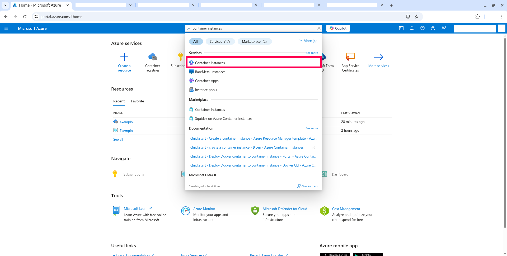
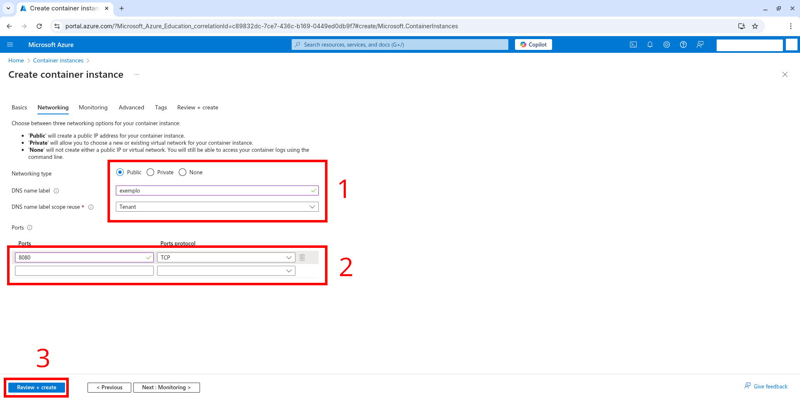
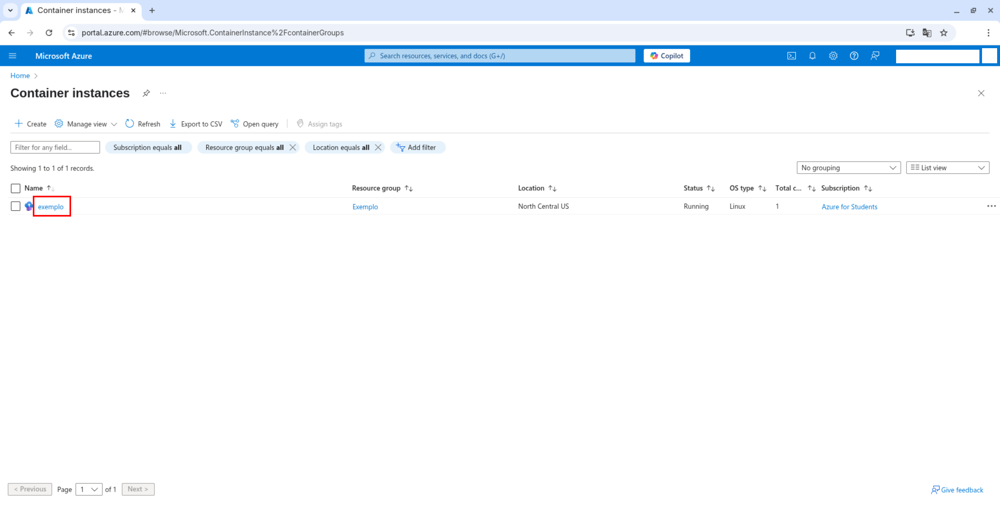
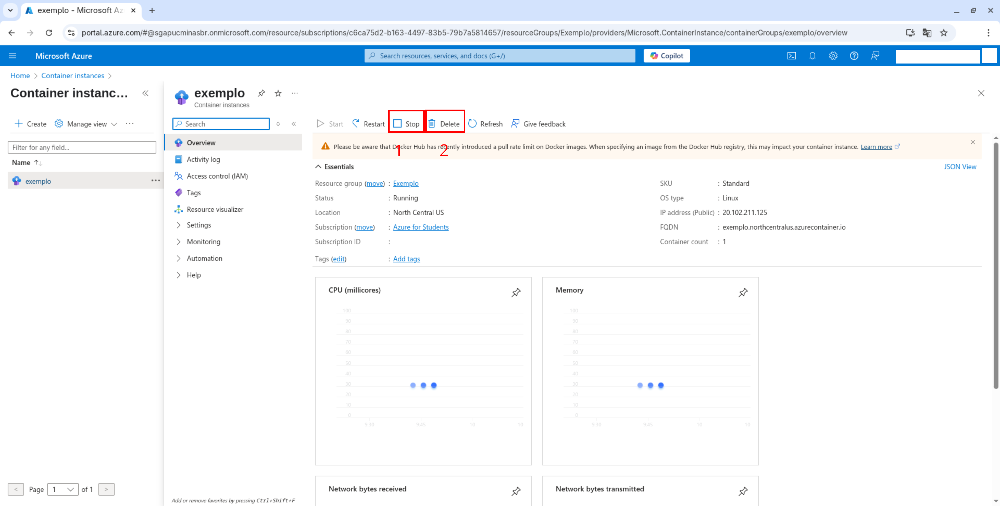

# Subindo uma imagem de container para a nuvem do Microsoft Azure

Neste STEP você subirá a aplicação containerizada para a nuvem do Microsoft Azure.

## STEP 6.1 - Criação de uma conta de estudante no Microsoft Azure

O Instituto de Ciências Exatas e Informática (ICEI) da PUC Minas possuí parceria com a Microsoft, dando um crédito de US$100 para cada aluno anualmente. Para criar sua conta de estudante, basta seguir o [tutorial no site do ICEI](https://icei.pucminas.br/index.php/azurepucminas).

## STEP 6.2 - Instalando o Azure CLI

Instale o Azure CLI em sua máquina. Siga os passos do tutorial oficial da Microsoft: https://learn.microsoft.com/pt-br/cli/azure/install-azure-cli

## STEP 6.3 - Realizando login no Azure CLI

Com o Azure CLI instalado, em um terminal, digite o seguinte comando:

```
az login
```

Uma janela no navegador web padrão se abrirá, e solicitará o seu login e senha do Microsoft Azure. Faça login com o usuário e senha utilizados na criação da conta do Azure.

No terminal, será exibida a seguinte mensagem:

```
A web browser has been opened at https://login.microsoftonline.com/organizations/oauth2/v2.0/authorize. Please continue the login in the web browser. If no web browser is available or if the web browser fails to open, use device code flow with `az login --use-device-code`.

Retrieving tenants and subscriptions for the selection...

[Tenant and subscription selection]

No     Subscription name    Subscription ID                       Tenant
-----  -------------------  ------------------------------------  ---------------
[1] *  Azure for Students   SEU-SUBSCRIPTION-ID                   sga.pucminas.br

The default is marked with an *; the default tenant is 'sga.pucminas.br' and subscription is 'Azure for Students' (SEU-SUBSCRIPTION-ID).

Select a subscription and tenant (Type a number or Enter for no changes):
```

Digite o número (```No```) da inscrição cujo ```Subscription name``` esteja escrito ```Azure for Students``` e pressione ENTER.

Para mais informações sobre o comando executado, acesse: [az login](https://learn.microsoft.com/pt-br/cli/azure/reference-index?view=azure-cli-latest#az-login).

## STEP 6.4 - Criando Container Registry no Microsoft Azure

### STEP 6.4.a - Utilizando o console do Microsoft Azure

Para criar um Container Instance, utilizando o Console do Azure, siga estes passos.

#### STEP 6.4.a.1 - Acessando o Container Registries

No [console do Microsoft Azure](https://portal.azure.com/), na barra de pesquisa, digite ```Container Registries```, e clique na opção 'Container Registries'. 


#### STEP 6.4.a.2 - Criando um novo container Registry

No menu 'Container Registries', clique no botão 'Create'.


Na aba basics, nos campos (em 1, na imagem abaixo), deixe da seguinte forma:

| Opção                  | Valor                |
|------------------------|----------------------|
| Subscription           | 'Azure for Students' |
| Resource group         | '(New) Exemplo'      |
| Registry name          | 'exemplo'            |
| Location               | 'North Central US'   |
| Use availability zones | Desmarcado           |
| Pricing plan           | 'Standard'           |

O 'Registry name' ```exemplo``` deve ser substituído pelo nome do seu container registry, que deve ser único.

Depois, clique na aba 'Review + Create' (em 2, na imagem abaixo).


E depois, clique em no botão 'Create', no canto inferior esquerdo.


Será mostrado o painel de Deployment com a mensagem 'Your deployment is complete'. Clique no botão ```Go to resource```. 


Será exibido o painel do container registry criado.


#### STEP 6.4.a.3 - Adicionando acesso de administrador ao Container Registry

No 'Container Registry' criado, clique em 'Settings' e em 'Access Keys'.

Marque a caixa de seleção ```Admin user```.


### STEP 6.4.b - Utilizando o Azure CLI

Para criar um Container Registry, utilizando o Azure CLI ao invés do Console, siga estes passos.

#### STEP 6.4.b.1 - Criando o Resource Group

Para criar um container registry usando o Azure CLI, em um terminal (ou prompt de comando), digite os seguintes comando:

```
az group create --location northcentralus --resource-group Exemplo --subscription SEU-SUBSCRIPTION-ID
```

Substitua o ```SEU-SUBSCRIPTION-ID``` pelo ID de sua inscrição no Azure, obtido no [STEP 6.3](#step-63---realizando-login-no-azure-cli).

Substitua ```Exemplo``` em ```--resource-group Exemplo``` pelo nome do resource group desejado.

Substitua ```exemplo``` em ```--name exemplo``` pelo nome de seu Container Registry, que deve ser único para toda a Azure.

Este comando cria um Resource Group (grupo de recursos) chamado ```Exemplo``` na região ```northcentralus```.

Para mais informações sobre o comando executado, acesse: [az group create](https://learn.microsoft.com/pt-br/cli/azure/group?view=azure-cli-latest#az-group-create).

#### STEP 6.4.b.2 - Criando o Container Registry

```
az acr create --name exemplo --resource-group Exemplo --sku Standard --admin-enabled --location northcentralus --subscription SEU-SUBSCRIPTION-ID
```

Substitua o ```SEU-SUBSCRIPTION-ID``` pelo ID de sua inscrição no Azure, obtido no [STEP 6.3](#step-63---realizando-login-no-azure-cli). E substitua ```Exemplo``` em ```--resource-group Exemplo``` pelo nome do resource group desejado.

Este comando cria um Container Registry chamado ```exemplo``` também na região ```northcentralus```.

Para mais informações sobre o comando executado, acesse: [az acr create](https://learn.microsoft.com/pt-br/cli/azure/acr?view=azure-cli-latest#az-acr-create).

## STEP 6.5 - Enviando a imagem para o Azure Container Registry

### STEP 6.5.1 - Faça login no Azure Container Registry

Para realizarmos login no Azure Container Registry, em um terminal (ou Prompt de Comando), digite o seguinte comando:

```
az acr login --name exemplo
```

O 'Registry name' ```exemplo``` deve ser substituído pelo nome do seu container registry.

Para mais informações sobre os comandos executados, acesse: [az acr login](https://learn.microsoft.com/pt-br/cli/azure/acr?view=azure-cli-latest#az-acr-login).

### STEP 6.5.2 - Crie uma tag para a imagem

Para que o Docker possa vincular a imagem criada ao container, é necessário a criação de uma tag. Para isso, em um terminal (ou Prompt de Comando), digite o seguinte comando:

```
docker tag exemplo:latest exemplo.azurecr.io/exemplo_imagem
```

O 'Registry name' ```exemplo``` em ```exemplo.azurecr.io``` deve ser substituído pelo nome do seu container registry.

### STEP 6.5.3 - Enviando a imagem ao container registry

Para enviarmos a imagem criada ao container registry, em um terminal (ou Prompt de Comando), digite o seguinte comando:

```
docker push exemplo.azurecr.io/exemplo_imagem:latest
```

O 'Registry name' ```exemplo``` em ```exemplo.azurecr.io``` deve ser substituído pelo nome do seu container registry.

## STEP 6.6 - Criando novo Container no Microsoft Azure

### STEP 6.6.a - Utilizando o console do Microsoft Azure

Para criar um Container Instance, utilizando o Console do Azure, siga estes passos.

No [console do Microsoft Azure](https://portal.azure.com/), na barra de pesquisa, digite ```Container instances```, e clique na opção 'Container instances'.



No menu 'Container instances', clique no botão 'Create'.


Na aba basics, nos campos (em 1, na imagem abaixo), deixe da seguinte forma:

| Opção                        | Valor                          |
|------------------------------|--------------------------------|
| Subscription                 | Azure for Students             |
| Resource group               | 'Exemplo'                      |
| Container name               | 'exemplo'                      |
| Region                       | (US) North Central US          |
| Availability zones (Preview) | None                           |
| SKU                          | Standard                       |
| Image source                 | Azure Container Registry       |
| Run with Azure Spot discount | Desmarcado                     |
| Registry                     | 'exemplo'                      |
| Image                        | 'exemplo_imagem'               |
| Image tag                    | 'latest'                       |
| OS Type                      | Linux                          |
| Size                         | 1 vcpu, 1.5 GiB memory, 0 gpus |

O 'Registry name ```exemplo``` deve ser substituído pelo nome do seu container registry.

O Resource group ```Exemplo``` deve ser substituído pelo nome do resource group criado junto com o 'Container Registry'.

Depois, clique no botão 'Next: Networking'.


Na aba 'Networking', deixe da seguinte forma:

| Opção                      | Valor     |
|----------------------------|-----------|
| Networking Type            | Public    |
| DNS Name Label             | 'exemplo' |
| DNS Name Label scope reuse | Tenant    |


| Ports | Ports Protocol |
|-------|----------------|
| 8080  | TCP            |

Depois, (em 3, na imagem abaixo) clique no botão 'Review + Create'.



Verifique se as configurações estão corretas, e clique em 'Create'. 


### STEP 6.6.b - Utilizando o Azure CLI

Para criar um Container Instance, utilizando o Azure CLI ao invés do Console, siga estes passos.

#### STEP 6.6.b.1 - Obtendo credenciais

Para criar um Container Instance, usando o Azure CLI, será necessário primeiro obter o nome de usuário e senha do Azure Container Registry criado. Para isso, em um terminal (ou prompt de comando), digite o seguinte comando: 

```
az acr credential show --name exemplo --subscription SEU-SUBSCRIPTION-ID
```

Substitua ```exemplo``` em ```--name exemplo``` pelo nome de seu Container Registry.

E será exibido em formato JSON o nome de usuário e as senhas do Container Registry.

Substitua o ```SEU-SUBSCRIPTION-ID``` pelo ID de sua inscrição no Azure, obtido no [STEP 6.3](#step-63---realizando-login-no-azure-cli).

Para mais informações do comando executado, acesse: [az acr credential show](https://learn.microsoft.com/pt-br/cli/azure/acr/credential?view=azure-cli-latest#az-acr-credential-show)

#### STEP 6.6.b.2 - Criando Container

E para criar o container, usando o Azure CLI, em um terminal (ou prompt de comando), digite o seguinte comando:

```
az container create --resource-group Exemplo --cpu 1 --dns-name-label exemplo --image exemplo.azurecr.io/exemplo_imagem:latest --location northcentralus --memory 1.5 --name exemplo --os-type Linux --ports 8080 --protocol TCP --sku Standard --subscription SEU-SUBSCRIPTION-ID
```

Substitua ```exemplo``` em ```--dns-name-label exemplo``` pelo nome de domínio desejado. E substitua ```exemplo``` em ```exemplo.azurecr.io/exemplo_imagem:latest``` pelo nome de seu Container Registry.

Substitua o ```SEU-SUBSCRIPTION-ID``` pelo ID de sua inscrição no Azure, obtido no [STEP 6.3](#step-63---realizando-login-no-azure-cli).

Substitua ```exemplo``` em ```--name exemplo``` pelo nome desejado para o seu container.

Para mais informações do comando executado, acesse: [az container create](https://learn.microsoft.com/pt-br/cli/azure/container?view=azure-cli-latest#az-container-create)

## STEP 6.7 - Acessando o container criado no navegador web

Em um navegador web, na barra de endereços, digite: ```http://```, seguido do 'DNS label' criado (feito nos steps [6.6.a](#step-66a---utilizando-o-console-do-microsoft-azure) ou [6.6.b.2](#step-66b2---criando-container)), seguido de ```northcentralus.azurecontainer.io```, ```:``` e da porta ```8080```.

Neste exemplo a url ficará da seguinte forma: ```http://exemplo.northcentralus.azurecontainer.io:8080```.

Se tudo estiver correto, será exibida a página da aplicação de exemplo.

## STEP 6.8 - Apagando os recursos criados

Para economizar os créditos de estudante do Microsoft Azure, recomenda-se que, quando terminar de utilizar a aplicação, pare a execução do container, e delete os recursos criados.

### STEP 6.8.a - Utilizando o console do Microsoft Azure

Para finalizar a execução do container e deletar os recursos criados, utilizando o Console do Microsoft Azure, siga estes passos.

#### STEP 6.8.a.1 - Parando e deletando o Container Instance

Para parar a execução do Container Instance,

No [console do Microsoft Azure](https://portal.azure.com/), na barra de pesquisa, digite ```Container instances```, e clique na opção 'Container instances'.


Será mostrado os Containers Instances criados. Clique no nome do container criado, e uma aba lateral se abrirá.



Clique em 'Stop', e será exibida uma caixa de confirmação, clique em 'Yes'. Dessa forma, o Container Instance irá parar de executar.

Depois, clique em 'Delete', e será exibida outra caixa de confirmação, clique em 'Yes'. Dessa forma, o Container Instance será deletado.




### STEP 6.8.b - Utilizando o Azure CLI

Para finalizar a execução do container e deletar os recursos criados, utilizando o Azure CLI, ao invés do Console, siga estes passos.

#### STEP 6.8.b.1 - Parando a execução do Container Instance

Para parar a execução do Container Instance, em um terminal (ou prompt de comando), digite o seguinte comando:

```
az container stop --name exemplo --resource-group Exemplo
```

Substitua ```exemplo``` em ```--name exemplo``` pelo nome do seu Container Instance.

E substitua ```Exemplo``` em ```--resource-group Exemplo``` pelo nome do Resource Group do container.

Para mais informações sobre o comando executado, acesse: [az container stop](https://learn.microsoft.com/pt-br/cli/azure/container?view=azure-cli-latest#az-container-stop).

#### STEP 6.8.b.2 - Excluindo o Container Instance

Para excluir o Container Instance, em um terminal (ou prompt de comando), digite o seguinte comando:

```
az container delete --name exemplo --resource-group Exemplo
```

Substitua ```exemplo``` em ```--name exemplo``` pelo nome do seu Container Instance.

E substitua ```Exemplo``` em ```--resource-group Exemplo``` pelo nome do Resource Group do container.

Será perguntado se deseja realizar essa operação. Digite ```y``` e pressione ENTER.

Para mais informações sobre o comando executado, acesse: [az container delete](https://learn.microsoft.com/pt-br/cli/azure/container?view=azure-cli-latest#az-container-delete).

#### STEP 6.8.b.3 - Excluindo o Container Registry

Para excluir o Container Registry, em um terminal (ou prompt de comando), digite o seguinte comando:

```
az acr delete --name exemplo
```

Substitua ```exemplo``` em ```--name exemplo``` pelo nome do seu Container Registry.

Será perguntado se deseja realizar essa operação. Digite ```y``` e pressione ENTER.

Para mais informações sobre o comando executado, acesse: [az acr delete](https://learn.microsoft.com/pt-br/cli/azure/acr?view=azure-cli-latest#az-acr-delete).

#### STEP 6.8.b.4 - Excluindo o Resource Group

Para excluir o Resource Group, em um terminal (ou prompt de comando), digite o seguinte comando:

```
az group delete --resource-group Exemplo
```

Substitua ```Exemplo``` em ```--resource-group Exemplo``` pelo nome do seu Resource Group.

Será perguntado se deseja realizar essa operação. Digite ```y``` e pressione ENTER.

Para mais informações sobre o comando executado, acesse: [az group delete](https://learn.microsoft.com/pt-br/cli/azure/group?view=azure-cli-latest#az-group-delete).