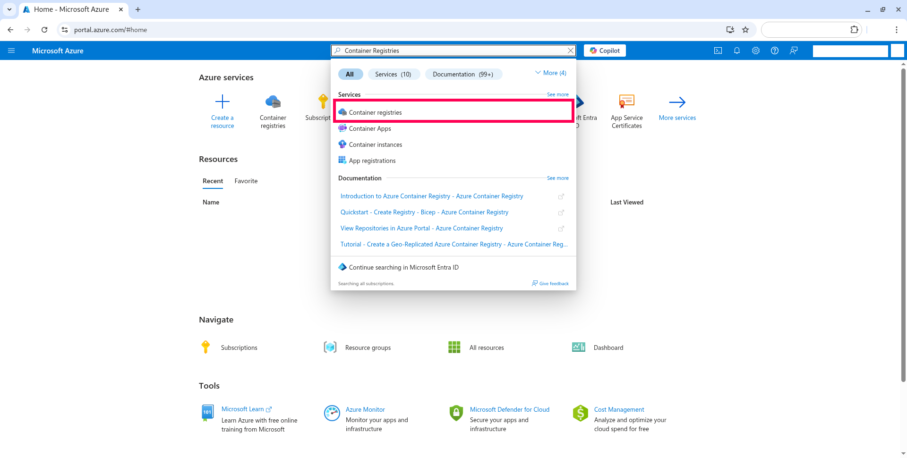

# Subindo uma imagem de container para a nuvem do Microsoft Azure

Neste STEP você subirá a aplicação containerizada para a nuvem do Microsoft Azure.

## STEP 6.1 - Criação de uma conta de estudante no Microsoft Azure

O Instituto de Ciências Exatas e Informática (ICEI) da PUC Minas possuí parceria com a Microsoft, dando um crédito de US$100 para cada aluno anualmente. Para criar sua conta de estudante, basta seguir o [tutorial no site do ICEI](https://icei.pucminas.br/index.php/azurepucminas).

## STEP 6.2 - Criando Container Registry no Microsoft Azure

### STEP 6.2.1 - Acessando o Container Registries

No [console do Microsoft Azure](https://portal.azure.com/), na barra de pesquisa, digite ```Container Registries```, e clique na opção 'Container Registries'. 



### STEP 6.2.2 - Criando um novo container Registry

No menu 'Container Registries', clique no botão 'Create'.


Na aba basics, nos campos (em 1, na imagem abaixo), deixe da seguinte forma:

| Opção                  | Valor                |
|------------------------|----------------------|
| Subscription           | 'Azure for Students' |
| Resource group         | '(New) Exemplo'      |
| Registry name          | 'exemplo'            |
| Location               | 'North Central US'   |
| Use availability zones | Desmarcado           |
| Pricing plan           | 'Standard'           |

O 'Registry name' ```exemplo``` deve ser substituído pelo nome do seu container registry, que deve ser único.

Depois, clique na aba 'Review + Create' (em 2, na imagem abaixo).


E depois, clique em no botão 'Create', no canto inferior esquerdo.


### STEP 6.2.3 - Instalando o Azure CLI

Instale o Azure CLI em sua máquina. Siga os passos do tutorial oficial da Microsoft: https://learn.microsoft.com/pt-br/cli/azure/install-azure-cli

### STEP 6.2.4 - Faça login no Azure CLI

Agora iremos realizar login no Azure CLI. Para isso, em um terminal (ou Prompt de Comando), digite o seguinte comando:

```
az login
```

Uma janela no navegador web se abrirá, e será exibida a opção para entrar em sua conta da Azure.

### STEP 6.2.5 - Faça login no Azure Container Registry

Para realizarmos login no Azure Container Registry, em um terminal (ou Prompt de Comando), digite o seguinte comando:

```
az acr login --name exemplo
```

O 'Registry name' ```exemplo``` deve ser substituído pelo nome do seu container registry, que deve ser único.

### STEP 6.2.6 - Crie uma tag para a imagem

Para que o Docker possa vincular a imagem criada ao container, é necessário a criação de uma tag. Para isso, em um terminal (ou Prompt de Comando), digite o seguinte comando:

```
docker tag exemplo:latest exemplo.azurecr.io/exemplo_imagem
```

O 'Registry name' ```exemplo``` deve ser substituído pelo nome do seu container registry, que deve ser único.

### STEP 6.2.7 - Enviando a imagem ao container registry

Para enviarmos a imagem criada ao container registry, em um terminal (ou Prompt de Comando), digite o seguinte comando:

```
docker push exemplo.azurecr.io/exemplo_imagem:latest
```

O 'Registry name' ```exemplo``` deve ser substituído pelo nome do seu container registry, que deve ser único.

### STEP 6.2.8 - Criando novo Container

No [console do Microsoft Azure](https://portal.azure.com/), na barra de pesquisa, digite ```Container instances```, e clique na opção 'Container instances'.


